# DSO101 Notes

| **Student** | Tshering Tenzin |
| **GitHub Repository** | [[Tshering-Tenzin_02250376_DSO101](https://github.com/02250376cst-cmd/Tshering-Tenzin_02250376_DSO101)] |

---

# Unit 1: Containerization with Docker

## 1.1 Introduction to Docker

### What is Docker?

Docker is an open-source platform designed to help developers build, package, and run applications inside isolated environments called **containers**. A container bundles an application together with everything it needs to run — libraries, config files, dependencies — so it behaves consistently no matter where it is deployed.

](image.png)

---

### Containerization Concepts

**Containerization** is the process of packaging an application and all its dependencies into a single portable unit called a container. Containers share the host operating system kernel but run in isolated user spaces, making them lightweight and fast.

Key ideas:
- **Isolation** — each container runs independently and cannot interfere with others
- **Portability** — a container built on your laptop runs the same way in the cloud
- **Immutability** — container images are read-only; changes are made by building new images
- **Reproducibility** — the same image always produces the same environment

---

### Docker Architecture

- **Docker Client** – The command-line interface (`docker` command) that users interact with
- **Docker Daemon (`dockerd`)** – The background service that builds, runs, and manages containers
- **Docker Images** – Read-only blueprints that define what a container looks like
- **Docker Containers** – Live, running instances created from a Docker image
- **Docker Registry** – A storage and distribution system for Docker images (e.g., Docker Hub)

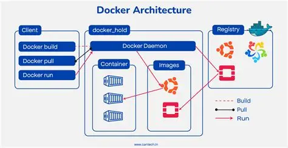

---

### Docker vs. Virtual Machines

| Feature | Docker (Containers) | Virtual Machines |
|---------|---------------------|------------------|
| Size | Lightweight (MBs) | Heavy (GBs) |
| Boot Time | Seconds | Minutes |
| Performance | Near-native | Slower (hypervisor overhead) |
| Isolation | Process-level | Full OS-level |
| OS | Shares host kernel | Full OS per VM |
| Portability | Very high | Lower |

> **When to use Docker:** Application packaging, microservices, CI/CD pipelines, and development environments. **When to use VMs:** When you need full OS isolation or different kernels (e.g., running Linux on a Windows host).

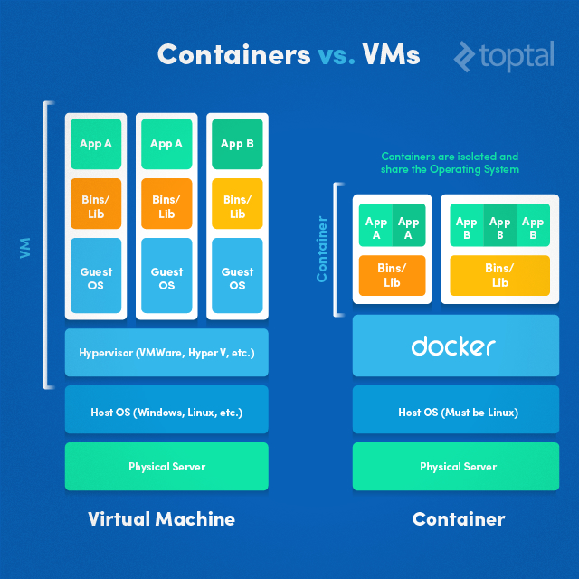

---

## 1.2 Working with Docker

### Installing Docker

Install Docker Desktop (Windows/macOS) or Docker Engine (Linux) from [https://docs.docker.com/get-docker/](https://docs.docker.com/get-docker/).

Verify the installation:

```bash
docker --version       # Check installed Docker version
docker info            # Display system-wide Docker information
docker help            # List all available commands
```

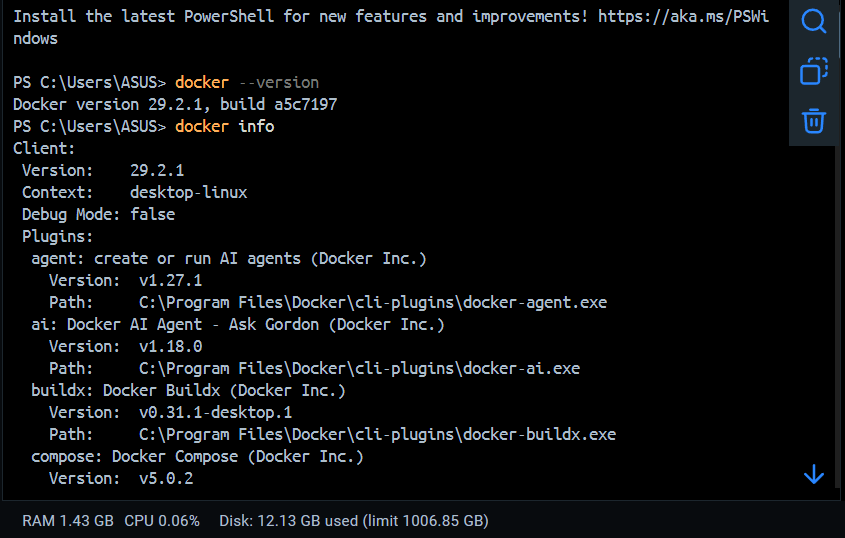

---

### Docker CLI Basics

```bash
docker --version                  # Show Docker version
docker info                       # Show system-wide info (containers, images, etc.)
docker help                       # List available commands
docker <command> --help           # Help for a specific command
```

---

### Pulling and Running Docker Images

```bash
docker pull nginx                 # Download the nginx image from Docker Hub
docker pull ubuntu:22.04          # Pull a specific version (tag)
docker run nginx                  # Run a container from the nginx image
docker run -it ubuntu bash        # Run Ubuntu interactively with a bash shell
docker run -d nginx               # Run nginx in detached (background) mode
docker run -p 8080:80 nginx       # Map host port 8080 to container port 80
```

---

## 1.3 Building Docker Images

### Dockerfile Syntax

A **Dockerfile** is a plain text script containing instructions that Docker follows step by step to build a custom image. Every instruction adds a new layer to the image.

| Instruction | Purpose |
|------------|---------|
| `FROM` | Sets the base image |
| `WORKDIR` | Sets the working directory inside the container |
| `COPY` | Copies files from host into the image |
| `ADD` | Like COPY but also supports URLs and auto-extracts archives |
| `RUN` | Executes a command during the image build |
| `CMD` | Default command to run when the container starts |
| `ENTRYPOINT` | Like CMD but harder to override at runtime |
| `EXPOSE` | Documents which port the container listens on |
| `ENV` | Sets environment variables |
| `ARG` | Defines build-time variables |

### Sample Dockerfile

```dockerfile
FROM node:22-alpine          # Use lightweight Node.js Alpine base image

WORKDIR /app                 # Set working directory inside the container

COPY package.json .          # Copy package.json first (for layer caching)

RUN npm install              # Install project dependencies

COPY . .                     # Copy the rest of the source code

EXPOSE 3000                  # Document that the app listens on port 3000

CMD ["npm", "start"]         # Default command when container starts
```


---

### Building Custom Images

```bash
docker build -t my-app .             # Build image named 'my-app' from current directory
docker build -t my-app:v1.0 .        # Build with a version tag
docker build -f Dockerfile.prod .    # Use a specific Dockerfile
```

```bash
docker run -p 3000:3000 my-app       # Run your built image
```


---

### Best Practices for Dockerfile Creation

- Place instructions that change least frequently near the top (better caching)
- Copy `package.json` before copying source code — this caches `npm install` unless dependencies change
- Use lightweight base images like `alpine` variants
- Combine multiple `RUN` commands with `&&` to reduce image layers
- Always specify image tags — never rely on `:latest` in production
- Use `.dockerignore` to exclude `node_modules`, `.git`, and other unnecessary files

```
# .dockerignore
node_modules
.git
*.log
.env
```

---

## 1.4 Docker Networking

### Docker Network Types

| Network Type | Description |
|-------------|-------------|
| `bridge` | Default network; containers on the same bridge can communicate |
| `host` | Container shares the host's network stack directly |
| `none` | No networking — completely isolated |
| `overlay` | For multi-host networking (Docker Swarm) |
| `macvlan` | Assigns a MAC address to a container, making it appear as a physical device |


---

### Creating and Managing Docker Networks

```bash
docker network ls                          # List all networks
docker network create mynetwork            # Create a custom bridge network
docker network inspect mynetwork           # View details of a network
docker network rm mynetwork                # Delete a network
```

---

### Container-to-Container Communication

```bash
# Connect a container to a custom network at run time
docker run -d --name app1 --network mynetwork nginx
docker run -d --name app2 --network mynetwork nginx

# Containers on the same network can reach each other by name
docker exec app2 curl http://app1
```

> On a custom bridge network, containers can resolve each other using their **container name** as the hostname. On the default bridge network, only IP addresses work.

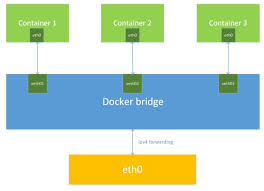
---

## 1.5 Docker Volumes

### Understanding Docker Storage Drivers

By default, data written inside a container is stored in the container's **writable layer** — this data disappears when the container is removed. Storage drivers (like `overlay2`) manage how image layers and container layers are stacked on disk.

---

### Creating and Managing Volumes

```bash
docker volume create myvolume             # Create a named volume
docker volume ls                          # List all volumes
docker volume inspect myvolume            # View volume details
docker volume rm myvolume                 # Delete a volume
```

### Types of Mounts

| Type | Command Example | Use Case |
|------|----------------|---------|
| Named Volume | `-v myvolume:/data` | Persistent database storage |
| Bind Mount | `-v /host/path:/container/path` | Development — sync source code live |
| tmpfs Mount | `--tmpfs /tmp` | Temporary in-memory storage |

---

### Persisting Data with Volumes

```bash
# Run a container with a named volume
docker run -d -v myvolume:/var/lib/mysql mysql

# Run with a bind mount (development mode)
docker run -d -v $(pwd):/app -p 3000:3000 my-app
```

> Data stored in a named volume **persists** even after the container is stopped or removed. Running a new container with the same volume name reattaches the same data.

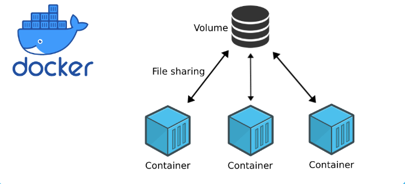

---

---

# Unit 2: Docker Compose and Multi-Container Applications

## 2.1 Introduction to Docker Compose

### What is Docker Compose?

Docker Compose is a tool for defining and running **multi-container** applications. Instead of running multiple `docker run` commands manually, you describe your entire application stack in a single `docker-compose.yml` file and bring it all up with one command.


---

### Docker Compose File Structure

```yaml
version: '3.8'               # Compose file format version

services:                    # Define each container as a service
  web:
    image: nginx             # Use an existing image
    ports:
      - "8080:80"            # Host port : Container port

  app:
    build: .                 # Build image from Dockerfile in current directory
    ports:
      - "3000:3000"
    environment:
      - NODE_ENV=development
    depends_on:
      - db                   # Start 'db' before 'app'

  db:
    image: postgres:16
    environment:
      POSTGRES_PASSWORD: secret
    volumes:
      - db-data:/var/lib/postgresql/data

volumes:
  db-data:                   # Define named volumes at the bottom
```

---

### Defining Services, Networks, and Volumes

```yaml
services:
  app:
    image: myapp
    networks:
      - frontend
      - backend

  db:
    image: postgres
    networks:
      - backend

networks:
  frontend:
  backend:

volumes:
  db-data:
```

> Services on the same Compose network can reach each other using their **service name** as the hostname. The `app` service above can connect to the database using `db` as the hostname.

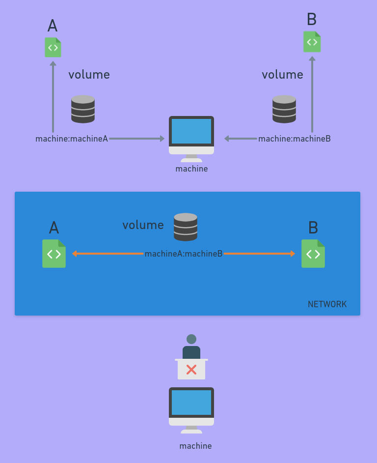
---

## 2.2 Managing Multi-Container Applications

### Creating a Multi-Container Application

A typical web application stack using Compose:

```yaml
version: '3.8'

services:
  frontend:
    build: ./frontend
    ports:
      - "3000:3000"
    depends_on:
      - backend

  backend:
    build: ./backend
    ports:
      - "5000:5000"
    environment:
      DATABASE_URL: postgres://user:pass@db:5432/mydb
    depends_on:
      - db

  db:
    image: postgres:16
    environment:
      POSTGRES_USER: user
      POSTGRES_PASSWORD: pass
      POSTGRES_DB: mydb
    volumes:
      - pgdata:/var/lib/postgresql/data

volumes:
  pgdata:
```

### Docker Compose Commands

```bash
docker-compose up              # Start all services (foreground)
docker-compose up -d           # Start all services (detached/background)
docker-compose down            # Stop and remove containers and networks
docker-compose down -v         # Also remove volumes
docker-compose build           # Rebuild images for all services
docker-compose ps              # List running Compose services
docker-compose logs            # View logs from all services
docker-compose logs app        # View logs from a specific service
docker-compose exec app bash   # Open a shell inside a running service
docker-compose restart         # Restart all services
```


---

### Scaling Services with Docker Compose

```bash
docker-compose up --scale app=3    # Run 3 instances of the 'app' service
```

> Note: When scaling, do not define a fixed `container_name` and use a load balancer or reverse proxy to distribute traffic across instances.

---

### Compose File Versions and Compatibility

| Version | Key Features |
|---------|-------------|
| `3.8` | Current stable; supports secrets, configs, deploy |
| `3.x` | Recommended for Docker Swarm and modern Compose |
| `2.x` | Legacy; supports `depends_on` condition checks |

> Always use version `3.8` or higher for new projects.

---

## 2.3 Docker Compose in Development Environments

### Local Development with Docker Compose

Use bind mounts so code changes on your host are reflected inside containers instantly — no rebuild needed.

```yaml
services:
  app:
    build: .
    ports:
      - "3000:3000"
    volumes:
      - .:/app                     # Bind mount: sync current directory into container
      - /app/node_modules          # Anonymous volume: protect node_modules from being overwritten
    environment:
      - NODE_ENV=development
```

---

### Debugging Applications in Containers

```bash
# Open a shell in a running service
docker-compose exec app sh

# View real-time logs
docker-compose logs -f app

# Check environment variables inside the container
docker-compose exec app env

# Inspect network and container details
docker inspect <container_id>
```

---

### Compose Overrides for Different Environments

Use a base `docker-compose.yml` and layer environment-specific settings with override files.

**`docker-compose.yml`** (base — shared across all environments):
```yaml
services:
  app:
    build: .
    ports:
      - "3000:3000"
```

**`docker-compose.override.yml`** (auto-applied in development):
```yaml
services:
  app:
    volumes:
      - .:/app
    environment:
      - NODE_ENV=development
```

**`docker-compose.prod.yml`** (for production):
```yaml
services:
  app:
    environment:
      - NODE_ENV=production
    restart: always
```

```bash
# Apply production override
docker-compose -f docker-compose.yml -f docker-compose.prod.yml up -d
```

---

## 2.4 Docker Compose Best Practices

### Organizing Compose Files

- Keep one `docker-compose.yml` per project at the root
- Use override files for dev/staging/prod differences
- Name services clearly after their role (`web`, `api`, `db`, `cache`)
- Group related services together in the file

### Environment Variables and Secrets Management

Use a `.env` file alongside `docker-compose.yml` to manage environment-specific values without hardcoding them.

**`.env` file:**
```
POSTGRES_USER=admin
POSTGRES_PASSWORD=supersecret
APP_PORT=3000
```

**`docker-compose.yml`:**
```yaml
services:
  app:
    ports:
      - "${APP_PORT}:3000"

  db:
    image: postgres:16
    environment:
      POSTGRES_USER: ${POSTGRES_USER}
      POSTGRES_PASSWORD: ${POSTGRES_PASSWORD}
```

> Add `.env` to `.gitignore` — never commit secrets to version control.

---

### Health Checks and Dependency Management

`depends_on` only waits for a container to **start**, not for the service inside to be **ready**. Use health checks to ensure services are truly ready before dependent services start.

```yaml
services:
  db:
    image: postgres:16
    healthcheck:
      test: ["CMD-SHELL", "pg_isready -U user"]
      interval: 10s
      timeout: 5s
      retries: 5

  app:
    build: .
    depends_on:
      db:
        condition: service_healthy    # Wait until db health check passes
```


---

---

# Unit 3: Docker Optimization & Registry

## 3.1 Optimizing Docker Images

### Multi-Stage Builds

Multi-stage builds allow you to use multiple `FROM` instructions in a single Dockerfile. This is the most powerful technique for reducing image size — you build in one stage and copy only the final output into a clean, minimal final image.

```dockerfile
# --- Stage 1: Build ---
FROM node:22-alpine AS builder

WORKDIR /app
COPY package*.json ./
RUN npm ci
COPY . .
RUN npm run build                   # Produces compiled files in /app/dist

# --- Stage 2: Production Image ---
FROM nginx:alpine                   # Start fresh with a tiny base image

COPY --from=builder /app/dist /usr/share/nginx/html   # Copy only the built output

EXPOSE 80
CMD ["nginx", "-g", "daemon off;"]
```

> The final image contains only nginx and the compiled output — no Node.js, no source code, no `node_modules`. This can cut image sizes from 900 MB down to under 30 MB.

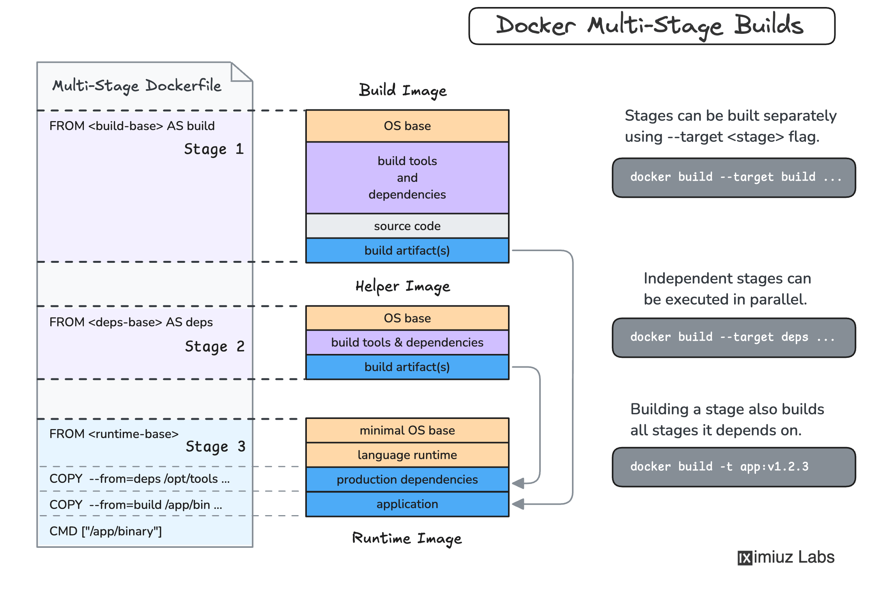
---

### Reducing Image Size and Layers

```dockerfile
# Bad: Multiple RUN commands = multiple layers
RUN apt-get update
RUN apt-get install -y curl
RUN apt-get clean

# Good: Combine into one layer
RUN apt-get update && \
    apt-get install -y curl && \
    apt-get clean && \
    rm -rf /var/lib/apt/lists/*
```

Additional tips:
- Use `alpine`-based images (`node:alpine`, `python:alpine`) — much smaller than full OS images
- Remove build tools and temp files in the same `RUN` layer that created them
- Use `.dockerignore` to avoid copying unnecessary files into the build context

```
# .dockerignore
node_modules
dist
.git
*.md
.env
Dockerfile
docker-compose*.yml
```

---

### Caching Strategies for Faster Builds

Docker caches each layer. A layer is invalidated when its instruction or any earlier instruction changes. Optimize layer order so that things that rarely change come first.

```dockerfile
# Optimized for caching — dependencies rarely change, source code does
FROM node:22-alpine
WORKDIR /app
COPY package*.json ./          # Copy manifest first
RUN npm ci                     # Cache this layer — only re-runs if package.json changes
COPY . .                       # Copy source code last
CMD ["npm", "start"]
```


---

## 3.2 Working with Docker Registries

### Docker Hub and Private Registries

A **Docker Registry** is a storage and distribution system for Docker images.

| Registry | Type | Use Case |
|---------|------|---------|
| Docker Hub | Public/Private | Default registry; free for public images |
| GitHub Container Registry (ghcr.io) | Private | Tightly integrated with GitHub Actions |
| Amazon ECR | Private | AWS deployments |
| Google Artifact Registry | Private | GCP deployments |
| Azure Container Registry | Private | Azure deployments |
| Self-hosted (Harbor, Nexus) | Private | On-premises or air-gapped environments |

---

### Pushing and Pulling Images

```bash
# Log in to Docker Hub
docker login

# Log in to GitHub Container Registry
docker login ghcr.io -u USERNAME --password TOKEN

# Pull an image from Docker Hub
docker pull nginx:alpine

# Tag your local image for a registry
docker tag my-app username/my-app:v1.0

# Push to Docker Hub
docker push username/my-app:v1.0

# Pull from Docker Hub
docker pull username/my-app:v1.0

# Push to GitHub Container Registry
docker tag my-app ghcr.io/username/my-app:v1.0
docker push ghcr.io/username/my-app:v1.0
```


---

### Image Tagging Strategies

| Strategy | Example | When to Use |
|---------|---------|------------|
| Semantic versioning | `myapp:1.2.3` | Stable production releases |
| Git SHA | `myapp:abc1234` | Traceability — know exact commit deployed |
| Branch name | `myapp:main` | Latest build from a branch |
| Environment | `myapp:staging` | Environment-specific promotions |
| `latest` | `myapp:latest` | Development only — avoid in production |

> Best practice: tag with both the Git SHA (for traceability) and a semantic version (for human readability). Never rely solely on `:latest` in CI/CD pipelines.

```bash
VERSION=$(git rev-parse --short HEAD)
docker build -t my-app:${VERSION} -t my-app:latest .
docker push my-app:${VERSION}
docker push my-app:latest
```
---

---

# Unit 4: Introduction to CI/CD and Jenkins

## 4.1 CI/CD Concepts and Principles

### Continuous Integration Fundamentals

**Continuous Integration (CI)** is the practice of frequently merging developer code into a shared branch — often multiple times per day. Every merge automatically triggers a build and test run, catching issues early before they compound.

The CI loop:
```
Write Code → Commit → Push → Automated Build → Automated Tests → Feedback
```

Benefits:
- Bugs are caught immediately when they are cheap to fix
- Reduces "integration hell" — the pain of merging long-lived branches
- Keeps the main branch always in a buildable state

---

### Continuous Delivery vs. Continuous Deployment

| Term | Definition |
|------|-----------|
| **Continuous Integration** | Auto-build and test on every commit |
| **Continuous Delivery** | Code is always in a deployable state; a human approves the final release |
| **Continuous Deployment** | Every passing build is deployed to production automatically — no human needed |

```
Commit → Build → Unit Tests → Integration Tests → Deploy to Staging → [Manual Approval] → Production
                                                                        ↑ Delivery stops here
                                                              Deployment skips the manual gate
```

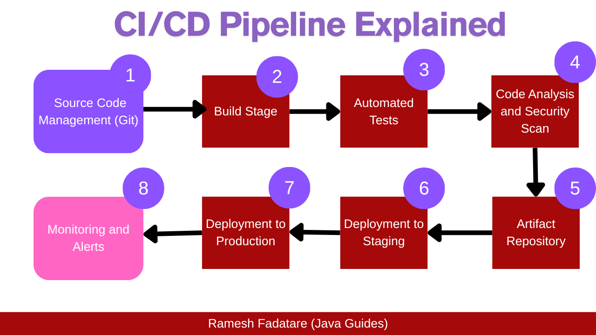

---

### Benefits and Challenges of CI/CD

**Benefits:**
- Catch bugs early when they are far cheaper to fix
- Deploy more frequently with less risk
- Eliminate repetitive manual testing and release processes
- Build confidence to ship at any time

**Challenges:**
- Proper setup requires an upfront time investment
- A pipeline is only as strong as its test coverage
- Teams must adapt development habits and workflows

---

## 4.2 Jenkins Architecture and Setup

### Jenkins Installation and Initial Configuration

Jenkins runs as a Java application and exposes a web UI on port **8080**.

```bash
# Run Jenkins via Docker
docker run -d \
  --name jenkins \
  -p 8080:8080 \
  -p 50000:50000 \
  -v jenkins_home:/var/jenkins_home \
  jenkins/jenkins:lts
```

After starting, retrieve the initial admin password:

```bash
docker exec jenkins cat /var/jenkins_home/secrets/initialAdminPassword
```

---

### Jenkins Architecture: Master and Agents

**Master (Controller):**
- The brain of Jenkins
- Handles scheduling jobs, serving the web UI (port 8080), storing configuration
- Does **not** run builds itself

**Agents (Nodes):**
- The workers that receive instructions from the master and actually run builds
- Can run on different operating systems
- Scale independently based on workload

> The master stays lean while agents handle the heavy lifting. You can add or remove agents without touching the master.


---

### Jenkins Plugins and Extensions

Jenkins is a minimal engine — almost every meaningful feature comes from a plugin.

| Plugin | Purpose |
|--------|---------|
| Git | Clone and interact with Git repositories |
| Pipeline | Enable Jenkinsfile-based pipeline execution |
| JUnit | Parse test results and visualize pass/fail trends |
| Blue Ocean | Clean, modern pipeline UI |
| Docker | Build images and run containers as build steps |
| Credentials Binding | Securely inject secrets into pipelines |
| Slack Notification | Send build alerts to Slack |
| Email Extension | Send HTML email notifications |

**To install:** `Manage Jenkins → Plugins → Available tab → Search → Install`

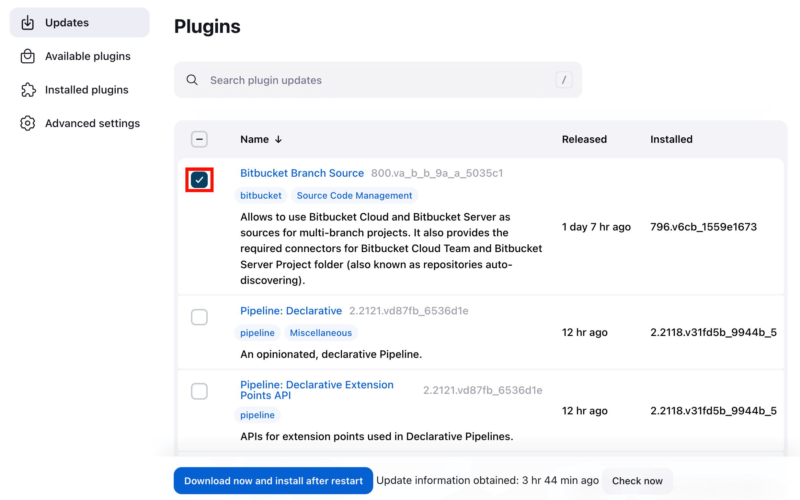

---

### Configuring Build Agents

Agents connect to the master via:
- **JNLP/TCP** (agent initiates the connection)
- **SSH** (master connects to the agent)

```groovy
// In a Jenkinsfile, target a specific agent by label
pipeline {
    agent { label 'linux' }
    ...
}
```

---

## 4.3 Jenkins Jobs and Builds

### Creating and Managing Jenkins Jobs

| Job Type | Description |
|---------|-------------|
| **Freestyle Project** | Configured through the web UI; simple but not version-controlled |
| **Pipeline** | Build logic in a `Jenkinsfile` stored in your repo |
| **Multibranch Pipeline** | Auto-discovers branches; creates a pipeline for each using that branch's `Jenkinsfile` |
| **Folder** | Organizes multiple jobs together |
| **Multi-configuration** | Runs the same job across multiple configurations (OS, JDK version, etc.) |

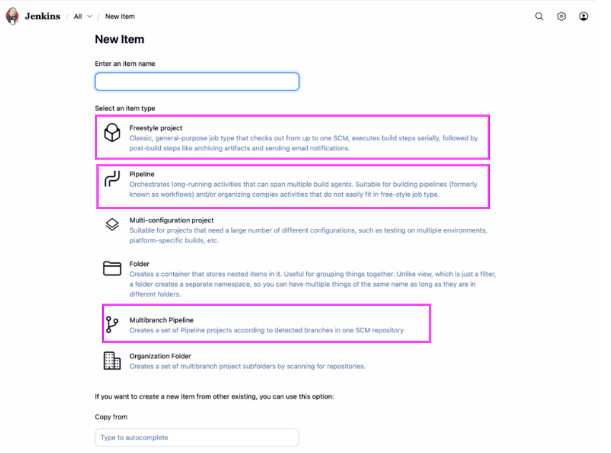
---

### Configuring Build Triggers

| Trigger | How It Works |
|---------|-------------|
| Poll SCM | Jenkins periodically checks the repo for new commits |
| GitHub Webhook | GitHub notifies Jenkins instantly on every push |
| Build periodically | Runs on a cron schedule (e.g., nightly at 2 AM) |
| Upstream trigger | Starts after another job completes |
| Manual | Triggered by a user clicking "Build Now" |

```
# Cron syntax examples
H/5 * * * *      # Every 5 minutes
0 2 * * *        # Every day at 2 AM
H H * * 1-5      # Once a day on weekdays
```

---

### Understanding Build Steps and Post-Build Actions

**Build steps** are the core actions in your pipeline:
- Run shell scripts (`sh 'npm test'`)
- Execute Maven, Gradle, or npm commands
- Invoke other Jenkins jobs
- Copy or archive files

**Post-build actions** run after the main build:
- Publish test reports
- Archive artifacts (JAR, WAR, Docker images)
- Send email/Slack notifications
- Trigger downstream jobs
- Deploy to a server

---

## 4.4 Jenkins Pipeline Basics

### Introduction to Jenkins Pipeline

A **Pipeline** is a suite of plugins that supports implementing and integrating CI/CD pipelines in Jenkins. The pipeline definition lives in a `Jenkinsfile` stored in your repository — treating the pipeline as code.


---

### Jenkinsfile Syntax and Structure

```groovy
pipeline {
    agent any                     // Run on any available agent

    environment {
        APP_NAME = 'myapp'        // Pipeline-wide environment variables
    }

    stages {
        stage('Build') {
            steps {
                echo 'Compiling source code...'
                sh 'mvn compile'
            }
        }

        stage('Test') {
            steps {
                sh 'mvn test'
            }
        }

        stage('Package') {
            steps {
                sh 'mvn package'
            }
        }

        stage('Deploy') {
            steps {
                echo "Deploying ${APP_NAME}..."
            }
        }
    }

    post {
        always {
            echo 'Runs regardless of outcome'
            junit '**/surefire-reports/*.xml'
        }
        success {
            echo 'Pipeline completed successfully!'
        }
        failure {
            echo 'Something went wrong — check the logs'
        }
    }
}
```

---

### Pipeline Stages and Steps

| Section | Purpose |
|---------|---------|
| `agent` | Where the pipeline runs (`any`, `label 'linux'`, `docker`, `none`) |
| `environment` | Define reusable variables scoped to the pipeline or stage |
| `stages` | Container block holding all stage definitions |
| `stage` | A logical phase (Build, Test, Deploy) — visible in the UI |
| `steps` | Shell commands or plugin steps to execute |
| `post` | Cleanup and notifications based on build outcome |


---

---

# Unit 5: Advanced Jenkins Pipeline and Integration

## 5.1 Declarative vs. Scripted Pipelines

### Declarative Pipeline Syntax

Declarative pipelines follow a clean, opinionated structure. They are easier to read and write, integrate seamlessly with Blue Ocean, and cover the vast majority of real-world use cases.

```groovy
pipeline {
    agent any
    stages {
        stage('Build') {
            steps {
                sh 'make'
            }
        }
    }
}
```

---

### Scripted Pipeline and Groovy Basics

Scripted pipelines use full Groovy syntax, giving you unrestricted programming flexibility — native loops, conditionals, try/catch, and anything Groovy can do. The trade-off is a steeper learning curve.

```groovy
node('any') {
    stage('Build') {
        try {
            sh 'make'
            if (currentBuild.result == 'SUCCESS') {
                echo 'Build completed successfully'
            }
        } catch (err) {
            echo "Build failed: ${err}"
            currentBuild.result = 'FAILURE'
        }
    }
}
```

---

### Choosing Between Declarative and Scripted

| Scenario | Recommendation |
|---------|---------------|
| New to Jenkins | Start with Declarative |
| Need complex conditionals or loops | Use Scripted |
| Building shared pipeline libraries | Scripted works better |
| Most production pipelines | Declarative is sufficient |
| Blue Ocean UI integration | Declarative only |

---

## 5.2 Pipeline as Code

### Version Controlling Jenkinsfiles

The core principle: your pipeline definition lives **in your repository**, not buried in the Jenkins web UI.

Why it matters:
- Pipeline changes go through pull requests and code review
- Each branch can have its own pipeline behavior
- Full history of every pipeline modification
- Roll back a bad pipeline change just like any other code

```
myproject/
├── src/
├── tests/
├── Dockerfile
├── docker-compose.yml
└── Jenkinsfile             ← Pipeline lives here
```

---

### Shared Libraries in Jenkins

Shared Libraries let you extract common pipeline logic into a reusable library stored in its own Git repository, then import it into any Jenkinsfile.

**Directory structure of a shared library:**
```
vars/
  slackNotify.groovy      # Called as slackNotify('message') in pipelines
  deployToServer.groovy
src/
  org/example/Utils.groovy
```

**`vars/slackNotify.groovy`:**
```groovy
def call(String message) {
    slackSend(channel: '#deployments', message: message)
}
```

**Using the library in a Jenkinsfile:**
```groovy
@Library('my-shared-library') _

pipeline {
    stages {
        stage('Deploy') {
            steps {
                slackNotify("Deploying ${env.APP_NAME} to production")
            }
        }
    }
}
```

---

### Reusable Pipeline Components

```groovy
// Define a reusable function inside a Jenkinsfile
def runTests(String testSuite) {
    sh "npm run test:${testSuite}"
    junit "test-results/${testSuite}/*.xml"
}

pipeline {
    agent any
    stages {
        stage('Unit Tests')       { steps { script { runTests('unit') } } }
        stage('Integration Tests') { steps { script { runTests('integration') } } }
    }
}
```

---

## 5.3 Integrating External Tools and Services

### Source Control Integration (Git, GitHub)

```groovy
stage('Checkout') {
    steps {
        git branch: 'main',
            url: 'https://github.com/myorg/myapp.git',
            credentialsId: 'github-creds'
    }
}
```

Or use the SCM checkout step (automatically uses the Multibranch pipeline's own repo):

```groovy
stage('Checkout') {
    steps {
        checkout scm
    }
}
```

---

### Build Tools and Package Managers

**Maven:**
```groovy
stage('Build') {
    steps {
        sh 'mvn clean package -DskipTests'
    }
}
```

**Node.js / npm:**
```groovy
stage('Build') {
    steps {
        sh 'npm ci'
        sh 'npm run build'
    }
}
```

**Gradle:**
```groovy
stage('Build') {
    steps {
        sh './gradlew build'
    }
}
```

---

### Artifact Repositories (Nexus, Artifactory)

Store compiled JARs, Docker images, or npm packages for later use or deployment.

```groovy
stage('Upload Artifact') {
    steps {
        sh 'mvn deploy -DaltDeploymentRepository=nexus::default::http://nexus:8081/releases/'
    }
}
```

```groovy
stage('Push Docker Image') {
    steps {
        sh 'docker push myregistry.example.com/myapp:${BUILD_NUMBER}'
    }
}
```

---

## 5.4 Testing in CI/CD Pipelines

### Unit Testing Integration

```groovy
stage('Unit Tests') {
    steps {
        sh 'mvn test'
    }
    post {
        always {
            junit 'target/surefire-reports/*.xml'     // Publish test results
        }
    }
}
```

> Tests that fail cause the build to turn **yellow (unstable)** rather than **red (failed)** — this helps distinguish test failures from build errors.

---

### Integration and End-to-End Testing

**Integration Tests** — verify services communicate correctly:
```groovy
stage('Integration Tests') {
    steps {
        sh 'docker-compose -f docker-compose.test.yml up --abort-on-container-exit'
    }
    post {
        always {
            sh 'docker-compose -f docker-compose.test.yml down'
        }
    }
}
```

**E2E Tests** — full browser/API simulation:
```groovy
stage('E2E Tests') {
    steps {
        sh 'npm run test:e2e'
    }
}
```

---

### Test Reporting and Analysis

| Test Type | Speed | Scope | Tools |
|-----------|-------|-------|-------|
| Unit | Fast | Single function/class | JUnit, pytest, Jest |
| Integration | Medium | Multiple services | TestContainers, Postman |
| E2E | Slow | Full user workflows | Selenium, Cypress, Playwright |

```groovy
post {
    always {
        junit '**/test-results/**/*.xml'      // JUnit XML reports
        publishHTML([
            reportDir: 'coverage',
            reportFiles: 'index.html',
            reportName: 'Code Coverage Report'
        ])
    }
}
```

---

---

# Unit 6: Jenkins Security and Best Practices

## 6.1 Jenkins Security

### User Authentication and Authorization

Jenkins supports multiple authentication methods:

| Method | Description |
|--------|-------------|
| Jenkins' own user database | Built-in accounts managed inside Jenkins |
| LDAP | Authenticate against an existing corporate directory |
| GitHub OAuth | Login with GitHub credentials |
| SAML | Enterprise single sign-on (Okta, Azure AD, etc.) |

**Authorization strategies:**

| Strategy | Description |
|---------|-------------|
| Matrix-based security | Fine-grained per-user/group permissions |
| Role-based (RBAC) | Assign roles (Admin, Developer, Viewer) and attach them to users |
| Project-based | Per-job permissions for sensitive pipelines |


---

### Credential Management in Jenkins

Never hardcode passwords or API keys in a Jenkinsfile. Use Jenkins' built-in **Credentials Store**.

**Credential types:**

| Type | Use Case |
|------|---------|
| Username/Password | Database credentials, basic auth |
| Secret text | API tokens, passwords |
| SSH private key | SSH server access |
| Certificate | TLS/SSL certificates |
| Docker Host Certificate | Docker daemon access |

**Storing credentials:**
`Manage Jenkins → Credentials → System → Global Credentials → Add Credentials`

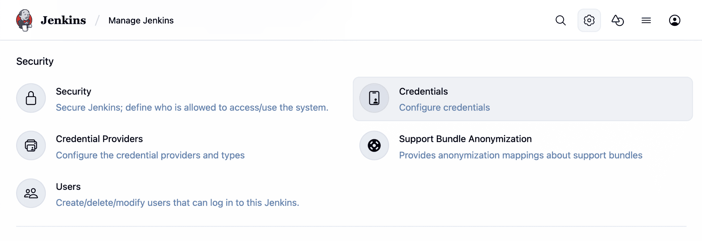

**Using credentials in a Jenkinsfile:**

```groovy
pipeline {
    environment {
        DOCKER_CREDS = credentials('docker-hub-creds')   // username:password pair
        API_TOKEN = credentials('my-api-token')          // secret text
    }
    stages {
        stage('Docker Login') {
            steps {
                sh 'echo $DOCKER_CREDS_PSW | docker login -u $DOCKER_CREDS_USR --password-stdin'
            }
        }
        stage('API Call') {
            steps {
                sh 'curl -H "Authorization: Bearer $API_TOKEN" https://api.example.com/deploy'
            }
        }
    }
}
```

---

### Securing Jenkins Instances

Key hardening steps:
- Enable HTTPS — never expose Jenkins on plain HTTP
- Disable anonymous read access
- Keep Jenkins and all plugins up to date
- Run Jenkins behind a reverse proxy (nginx)
- Restrict agent-to-master security (do not allow agents to run arbitrary code on the master)
- Regularly audit user accounts and remove stale accounts
- Enable audit trail logging (Audit Trail plugin)

```groovy
// Limit which scripts agents can run — Script Security plugin
@NonCPS
def parseXml(String xml) {
    // Approved script execution
}
```


---

## 6.2 Pipeline Optimization

### Parallelizing Pipeline Stages

Run multiple stages simultaneously to cut pipeline time.

```groovy
stage('Parallel Tests') {
    parallel {
        stage('Unit') {
            steps { sh 'npm run test:unit' }
        }
        stage('Integration') {
            steps { sh 'npm run test:integration' }
        }
        stage('Lint') {
            steps { sh 'npm run lint' }
        }
    }
}
```


---

### Caching and Artifact Management

```groovy
stage('Install Dependencies') {
    steps {
        // Restore cache if available (with Pipeline Utility Steps plugin)
        cache(maxCacheSize: 500, caches: [
            arbitraryFileCache(path: 'node_modules', cacheValidityDecidingFile: 'package-lock.json')
        ]) {
            sh 'npm ci'
        }
    }
}
```

```groovy
post {
    success {
        archiveArtifacts artifacts: 'dist/**', fingerprint: true    // Save build output
    }
}
```

---

### Performance Tuning for Jenkins

- Allocate sufficient heap memory: `-Xmx2048m` JVM flag
- Use multiple small agents instead of one large one
- Clean workspaces after builds to prevent disk bloat
- Discard old builds to free storage

```groovy
options {
    buildDiscarder(logRotator(numToKeepStr: '10'))   // Keep only last 10 builds
    timeout(time: 30, unit: 'MINUTES')               // Fail if build exceeds 30 min
}
```

---

## 6.3 Monitoring and Logging

### Jenkins Monitoring and Alerting

Key metrics to monitor:
- Build queue length and wait times
- Agent utilization
- Build duration trends
- Failure rates by job

Monitoring tools:
- **Prometheus + Grafana** — Jenkins exposes metrics via the Prometheus Metrics plugin
- **Datadog** — Native Jenkins integration
- **CloudWatch** — For Jenkins running on AWS


---

### Log Management and Analysis

```groovy
// Capture and archive logs
post {
    always {
        archiveArtifacts artifacts: '**/*.log', allowEmptyArchive: true
    }
}
```

Send logs to a centralized log management platform:
- **ELK Stack** (Elasticsearch, Logstash, Kibana)
- **Splunk**
- **Datadog Logs**

---

### Auditing Jenkins Activities

Install the **Audit Trail** plugin to log all Jenkins configuration changes and build triggers with timestamps and user information.

`Manage Jenkins → System → Audit Trail → Configure log location`


---

## 6.4 Jenkins Best Practices

### Pipeline Design Patterns

```groovy
// Pattern: Environment-aware deployment
stage('Deploy') {
    when {
        branch 'main'
    }
    steps {
        script {
            def target = env.BRANCH_NAME == 'main' ? 'production' : 'staging'
            sh "./deploy.sh ${target}"
        }
    }
}
```

```groovy
// Pattern: Manual approval gate before production
stage('Deploy to Production') {
    input {
        message "Ready to deploy to production?"
        ok "Deploy"
        submitter "admin,lead"
    }
    steps {
        sh './deploy-prod.sh'
    }
}
```

---

### Error Handling and Recovery

```groovy
stage('Deploy') {
    steps {
        script {
            try {
                sh './deploy.sh'
            } catch (Exception e) {
                echo "Deployment failed: ${e.message}"
                sh './rollback.sh'          // Automatic rollback on failure
                error "Deployment failed and was rolled back"
            }
        }
    }
}
```

```groovy
// Retry on transient failures
steps {
    retry(3) {
        sh 'curl https://flaky-service.example.com/health'
    }
}
```

---

### Best Practices Summary

| Practice | Why It Matters |
|----------|---------------|
| Store Jenkinsfile in version control | Enables code review and full change history |
| Use Declarative pipeline syntax | More readable and easier to maintain |
| Run tests in parallel | Reduces total pipeline time |
| Publish test results | Track quality trends over time |
| Use the Credentials plugin | Keeps secrets out of code |
| Clean workspace after builds | Prevents disk space issues |
| Use shared libraries | Avoid copy-paste pipelines |
| Set build timeouts | Prevent runaway builds |
| Discard old builds | Manage disk usage |
| Enable HTTPS | Secure Jenkins communication |

---

# Unit 7: GitHub Actions

## 7.1 Introduction to GitHub Actions

### What is GitHub Actions?

GitHub Actions is a built-in CI/CD and automation platform directly integrated into GitHub. It lets you automate workflows — like building, testing, and deploying your code — right from your repository, without needing any external servers or tools.

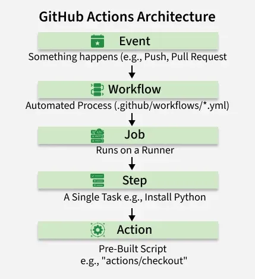
---

### GitHub Actions Concepts and Components

- **Workflow** – An automated process defined in a YAML file stored in `.github/workflows/`. A repository can have multiple workflows.
- **Event** – A trigger that starts a workflow (e.g., a push, pull request, schedule, or manual trigger).
- **Job** – A set of steps that run on the same machine (runner). Jobs run in parallel by default.
- **Step** – An individual task inside a job. Steps run in sequence and can run shell commands or use pre-built Actions.
- **Action** – A reusable unit of code that performs a single task (e.g., checking out code, setting up Node.js).
- **Runner** – The virtual machine that executes a job. GitHub provides hosted runners (Ubuntu, Windows, macOS) or you can self-host your own.

---

### Workflow File Structure and Syntax

All workflow files are stored in `.github/workflows/` inside your repository and written in YAML.

```yaml
name: CI Pipeline                  # Name shown in the GitHub Actions UI

on:                                # Events that trigger this workflow
  push:
    branches: [ "main" ]
  pull_request:
    branches: [ "main" ]

jobs:
  build:                           # Job ID (any name)
    runs-on: ubuntu-latest         # Runner environment

    steps:
      - name: Checkout code
        uses: actions/checkout@v4  # Pre-built action to clone the repo

      - name: Set up Node.js
        uses: actions/setup-node@v4
        with:
          node-version: '20'

      - name: Install dependencies
        run: npm install

      - name: Run tests
        run: npm test
```

---

### GitHub Actions vs. Jenkins

| Feature | GitHub Actions | Jenkins |
|---------|---------------|---------|
| Setup | Zero setup — built into GitHub | Requires a separate server |
| Configuration | YAML files in the repo | Jenkinsfile or web UI |
| Hosting | GitHub-hosted runners included | Self-hosted only |
| Ecosystem | GitHub Marketplace Actions | Jenkins Plugin Ecosystem |
| Cost | Free tier available | Free (self-hosted infrastructure costs) |
| GitHub Integration | Native | Requires webhook plugins |
| Learning Curve | Low | Medium-High |

> **Choose GitHub Actions** when your code is already on GitHub and you want simple, integrated CI/CD. **Choose Jenkins** when you need deep customization, enterprise pipelines, or your code is not on GitHub.

---

## 7.2 Creating GitHub Actions Workflows

### Defining Jobs and Steps

By default, all jobs run **in parallel**. Use `needs:` to define dependencies between jobs and run them sequentially.

```yaml
jobs:
  build:
    runs-on: ubuntu-latest
    steps:
      - uses: actions/checkout@v4
      - run: npm run build

  test:
    runs-on: ubuntu-latest
    needs: build                   # Wait for 'build' to finish first
    steps:
      - uses: actions/checkout@v4
      - run: npm test

  deploy:
    runs-on: ubuntu-latest
    needs: test                    # Wait for 'test' to finish first
    steps:
      - run: echo "Deploying..."
```

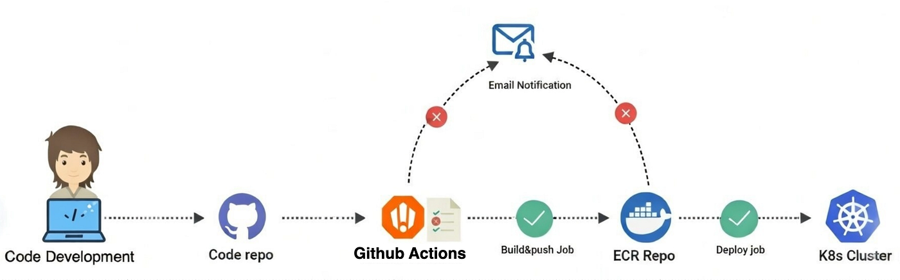

---

### Using Pre-Built Actions

Actions are reusable steps published on the [GitHub Marketplace](https://github.com/marketplace?type=actions). Reference them with `uses:`.

| Action | What It Does |
|--------|-------------|
| `actions/checkout@v4` | Clones your repository into the runner |
| `actions/setup-node@v4` | Installs a specific version of Node.js |
| `actions/setup-python@v5` | Installs a specific version of Python |
| `actions/setup-java@v4` | Installs a specific version of Java |
| `actions/upload-artifact@v4` | Saves build outputs for later jobs |
| `actions/download-artifact@v4` | Retrieves previously saved artifacts |
| `actions/cache@v4` | Caches dependencies to speed up builds |

```yaml
steps:
  - name: Checkout
    uses: actions/checkout@v4

  - name: Setup Python
    uses: actions/setup-python@v5
    with:
      python-version: '3.12'

  - name: Install dependencies
    run: pip install -r requirements.txt
```

---

### Creating Custom Actions

You can write your own reusable Actions in three forms:

| Type | Language | Best For |
|------|----------|---------|
| JavaScript | Node.js | Fast; runs directly on the runner |
| Docker Container | Any | Full environment control |
| Composite | YAML steps | Bundling multiple existing steps |

**Composite Action Example** — create `.github/actions/setup-app/action.yml`:

```yaml
name: 'Setup Application'
description: 'Checkout code and install dependencies'

runs:
  using: 'composite'
  steps:
    - name: Checkout
      uses: actions/checkout@v4

    - name: Install deps
      run: npm install
      shell: bash
```

Then use it in any workflow:

```yaml
steps:
  - uses: ./.github/actions/setup-app
```


---

## 7.3 CI/CD with GitHub Actions

### Building and Testing Applications

**Node.js CI:**

```yaml
name: Node.js CI

on: [push, pull_request]

jobs:
  build-and-test:
    runs-on: ubuntu-latest
    steps:
      - uses: actions/checkout@v4

      - uses: actions/setup-node@v4
        with:
          node-version: '20'
          cache: 'npm'

      - run: npm ci
      - run: npm run build
      - run: npm test
```

**Python CI:**

```yaml
name: Python CI

on: [push]

jobs:
  test:
    runs-on: ubuntu-latest
    steps:
      - uses: actions/checkout@v4

      - uses: actions/setup-python@v5
        with:
          python-version: '3.12'

      - run: pip install -r requirements.txt
      - run: pytest
```


---

### Deploying to Various Platforms

**Deploy to GitHub Pages:**

```yaml
name: Deploy to GitHub Pages

on:
  push:
    branches: ["main"]

permissions:
  contents: read
  pages: write
  id-token: write

jobs:
  deploy:
    environment:
      name: github-pages
    runs-on: ubuntu-latest
    steps:
      - uses: actions/checkout@v4
      - run: npm run build
      - uses: actions/upload-pages-artifact@v3
        with:
          path: './dist'
      - uses: actions/deploy-pages@v4
```

**Deploy via SSH:**

```yaml
steps:
  - uses: appleboy/ssh-action@v1
    with:
      host: ${{ secrets.SERVER_HOST }}
      username: ${{ secrets.SERVER_USER }}
      key: ${{ secrets.SSH_PRIVATE_KEY }}
      script: |
        cd /var/www/myapp
        git pull origin main
        npm install && pm2 restart app
```


---

### Automating Releases and Versioning

Automatically create a GitHub Release when a version tag is pushed.

```yaml
name: Create Release

on:
  push:
    tags:
      - 'v*'                           # Triggers on v1.0.0, v2.3.1, etc.

jobs:
  release:
    runs-on: ubuntu-latest
    steps:
      - uses: actions/checkout@v4

      - uses: softprops/action-gh-release@v2
        with:
          generate_release_notes: true  # Auto-generate notes from commit history
```

---

## 7.4 Advanced GitHub Actions Configurations & Tooling

### Matrix Builds and Strategy

Matrix builds run the same job across multiple configurations simultaneously — test across OS versions, language versions, or any combination.

```yaml
jobs:
  test:
    runs-on: ${{ matrix.os }}

    strategy:
      matrix:
        os: [ubuntu-latest, windows-latest, macos-latest]
        node-version: [18, 20, 22]
        # Creates 3 × 3 = 9 parallel jobs

    steps:
      - uses: actions/checkout@v4

      - uses: actions/setup-node@v4
        with:
          node-version: ${{ matrix.node-version }}

      - run: npm test
```

**Excluding specific combinations:**

```yaml
strategy:
  matrix:
    os: [ubuntu-latest, windows-latest]
    node-version: [18, 20]
    exclude:
      - os: windows-latest
        node-version: 18
```


---

### Environment Secrets and Variables

**Secrets** are encrypted values stored in GitHub. Never hardcode passwords, tokens, or API keys in YAML files.

**Where to add secrets:** `Repository → Settings → Secrets and variables → Actions → New repository secret`


```yaml
steps:
  - name: Login to Docker Hub
    run: echo "${{ secrets.DOCKER_PASSWORD }}" | docker login -u ${{ secrets.DOCKER_USERNAME }} --password-stdin

  - name: Deploy
    env:
      API_KEY: ${{ secrets.API_KEY }}
    run: ./deploy.sh
```

**Variables (non-sensitive configuration):**

```yaml
env:
  APP_NAME: ${{ vars.APP_NAME }}
  NODE_ENV: production
```

**Environment-specific secrets (staging vs production):**

```yaml
jobs:
  deploy-prod:
    environment: production          # Uses secrets scoped to 'production' environment
    runs-on: ubuntu-latest
    steps:
      - run: echo "Deploying to ${{ secrets.PROD_SERVER }}"
```

---

### Caching Dependencies and Artifacts

**Caching with `actions/cache`:**

```yaml
steps:
  - uses: actions/checkout@v4

  - uses: actions/cache@v4
    with:
      path: ~/.npm
      key: ${{ runner.os }}-node-${{ hashFiles('**/package-lock.json') }}
      restore-keys: |
        ${{ runner.os }}-node-

  - run: npm ci
```

> The cache `key` is based on the lock file hash. If `package-lock.json` changes, the cache is invalidated and re-downloaded fresh.

**Built-in caching via setup actions:**

```yaml
- uses: actions/setup-node@v4
  with:
    node-version: '20'
    cache: 'npm'              # Handles caching automatically

- uses: actions/setup-python@v5
  with:
    python-version: '3.12'
    cache: 'pip'
```

**Artifacts:**

```yaml
jobs:
  build:
    steps:
      - run: npm run build
      - uses: actions/upload-artifact@v4
        with:
          name: build-files
          path: dist/
          retention-days: 7

  deploy:
    needs: build
    steps:
      - uses: actions/download-artifact@v4
        with:
          name: build-files
          path: dist/
      - run: ./deploy.sh
```

---

### Additional Advanced Features

**Concurrency Control** — prevent simultaneous deployments:

```yaml
concurrency:
  group: production-deploy
  cancel-in-progress: true
```

**Workflow Dispatch (Manual Trigger):**

```yaml
on:
  workflow_dispatch:
    inputs:
      environment:
        description: 'Deploy target'
        required: true
        default: 'staging'
        type: choice
        options: [staging, production]
```


**Reusable Workflows:**

```yaml
# .github/workflows/deploy.yml — reusable workflow
on:
  workflow_call:
    inputs:
      environment:
        required: true
        type: string

jobs:
  deploy:
    runs-on: ubuntu-latest
    steps:
      - run: echo "Deploying to ${{ inputs.environment }}"
```

```yaml
# Calling workflow
jobs:
  call-deploy:
    uses: ./.github/workflows/deploy.yml
    with:
      environment: production
```

---

## Best Practices Summary

| Practice | Why It Matters |
|----------|---------------|
| Store workflows in `.github/workflows/` | GitHub auto-discovers and runs them |
| Pin action versions (`@v4`) | Prevents unexpected breaking changes |
| Use `npm ci` instead of `npm install` | Faster; uses exact lock file |
| Cache dependencies | Cuts minutes off every run |
| Store secrets in GitHub Secrets | Keeps credentials out of code |
| Use matrix builds | Catches environment-specific bugs early |
| Use `concurrency` for deployments | Prevents race conditions in production |
| Use reusable workflows | Avoids copy-paste across projects |
| Use environments for staging/prod | Separate secrets and approval gates per environment |

---
 
# Lab 1: Basic Docker Commands
1.
2.
3.
4.
5.
6.
7.
8.
9.
10.
11.
12.
13.
14.
15.
16.
17.


# Lab 2:

## References

- [GitHub Actions Documentation](https://docs.github.com/en/actions)
- [GitHub Actions Marketplace](https://github.com/marketplace?type=actions)
- [Workflow Syntax Reference](https://docs.github.com/en/actions/writing-workflows/workflow-syntax-for-github-actions)
- [Reusable Workflows](https://docs.github.com/en/actions/sharing-automations/reusing-workflows)
- [Encrypted Secrets](https://docs.github.com/en/actions/security-for-github-actions/security-guides/using-secrets-in-github-actions)
- [Jenkins Pipeline Documentation](https://www.jenkins.io/doc/book/pipeline/)
- [Docker Documentation](https://docs.docker.com/)
- [Docker Compose Reference](https://docs.docker.com/compose/compose-file/)

