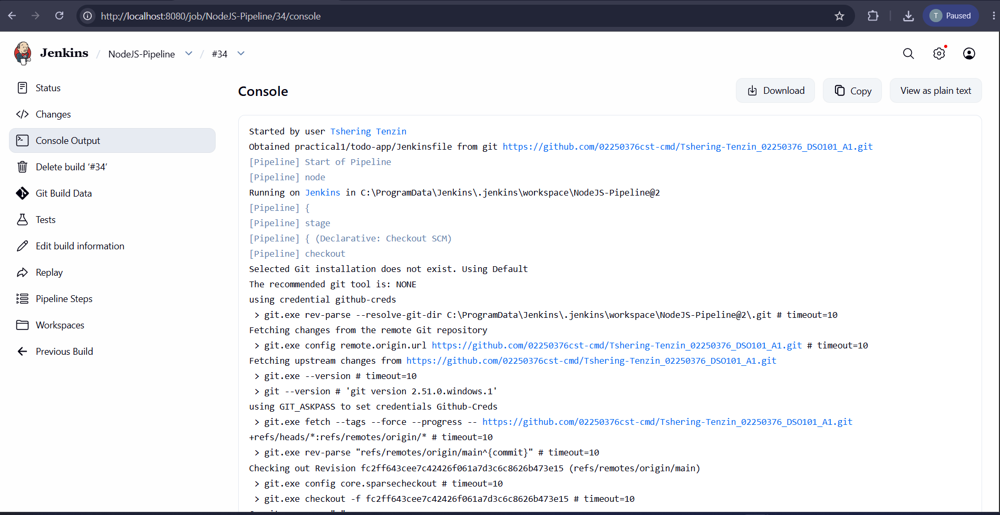

# Tshering Tenzin | 02250376 | DSO101 | Assignment 2

## Jenkins CI/CD Pipeline for Todo List Application

---

## Table of Contents
- [Overview](#overview)
- [Tools & Technologies](#tools--technologies)
- [Task 1: Jenkins Setup](#task-1-jenkins-setup)
- [Task 2: GitHub Repository Setup](#task-2-github-repository-setup)
- [Task 3: Jenkinsfile Pipeline](#task-3-jenkinsfile-pipeline)
- [Task 4: Run the Pipeline](#task-4-run-the-pipeline)
- [Pipeline Stages](#pipeline-stages)
- [Test Configuration](#test-configuration)
- [Challenges Faced](#challenges-faced)

---

## Overview

This assignment configures a Jenkins CI/CD pipeline to automate the build, test, and deployment of the Todo List application from Assignment 1. The pipeline automates:

- Code checkout from GitHub
- Dependency installation via npm
- Build step
- Unit testing with Jest (JUnit reports)
- Docker image build and push to Docker Hub

---

## Tools & Technologies

| Tool | Purpose |
|------|---------|
| Jenkins | CI/CD automation |
| GitHub | Source code hosting |
| Node.js & npm | JavaScript runtime & package management |
| Jest + jest-junit | Unit testing & JUnit report generation |
| Docker | Containerization |

---

## Task 1: Jenkins Setup

### 1. Install Jenkins
- Downloaded Jenkins from [jenkins.io/download](https://jenkins.io/download)
- Ran Jenkins on `http://localhost:8080`
- Completed initial setup wizard using the admin password from:
  ```
  # Windows
  C:\Users\<username>\.jenkins\secrets\initialAdminPassword
  ```

### 2. Install Required Plugins
Navigated to **Manage Jenkins → Plugins → Available** and installed:
-  NodeJS Plugin
-  Pipeline
-  GitHub Integration
-  Docker Pipeline
-  JUnit Plugin

### 3. Configure Node.js in Jenkins
1. Go to **Manage Jenkins → Tools → NodeJS**
2. Click **Add NodeJS**
3. Name: `NodeJS`
4. Version: `LTS v20.x`
5. Click **Save**

---

## Task 2: GitHub Repository Setup

### 1. Repository
GitHub repo contains the full Todo List app from Assignment 1:
```
https://github.com/tsheringtenzin/Tshering-Tenzin_02250376_DSO101_A1
```

### 2. Generate GitHub Personal Access Token (PAT)
1. Go to GitHub → **Settings → Developer Settings → Personal Access Tokens**
2. Click **Generate new token (classic)**
3. Select scopes: `repo`, `admin:repo_hook`
4. Copy and save the token

### 3. Add GitHub Credentials in Jenkins
1. Go to **Manage Jenkins → Credentials → Global → Add Credentials**
2. Kind: `Username with password`
3. Username: `tsheringtenzin`
4. Password: *(GitHub PAT)*
5. ID: `github-creds`
6. Click **Save**

### 4. Add Docker Hub Credentials in Jenkins
1. Same as above but:
2. Username: `tsheringtenzin`
3. Password: *(Docker Hub password)*
4. ID: `docker-hub-creds`

---

## Task 3: Jenkinsfile Pipeline

Created a `Jenkinsfile` in the repo root:

```groovy
pipeline {
    agent any

    tools {
        nodejs 'NodeJS'
    }

    stages {

        stage('Checkout') {
            steps {
                git branch: 'main',
                    url: 'https://github.com/02250376cst-cmd/Tshering-Tenzin_02250376_DSO101_A1.git',
                    credentialsId: 'github-creds'
            }
        }

        stage('Backend - Install') {
            steps {
                dir('practical1/todo-app/backend') {
                    bat 'npm install'
                }
            }
        }

        stage('Backend - Build') {
            steps {
                dir('practical1/todo-app/backend') {
                    bat 'npm run build || echo "No build script"'
                }
            }
        }

        stage('Backend - Test') {
            steps {
                dir('practical1/todo-app/backend') {
                    bat 'npm test'
                }
            }
            post {
                always {
                    junit allowEmptyResults: true,
                          testResults: 'practical1/todo-app/backend/junit.xml'
                }
            }
        }

        stage('Frontend - Install and Build') {
            steps {
                dir('practical1/todo-app/frontend') {
                    bat 'npm install'
                    bat 'npm run build'
                }
            }
        }

        stage('Deploy Backend Image') {
            steps {
                dir('practical1/todo-app/backend') {
                    bat 'docker build -t 02250376tt/be-todo:02250376 .'
                }
            }
        }

    }
}
```

---

## Task 4: Run the Pipeline

### Create Pipeline in Jenkins
1. Jenkins Dashboard → **New Item**
2. Name: `todo-pipeline`
3. Type: **Pipeline** → Click OK
4. Under **Pipeline** section:
   - Definition: `Pipeline script from SCM`
   - SCM: `Git`
   - Repository URL: `https://github.com/tsheringtenzin/Tshering-Tenzin_02250376_DSO101_A1.git`
   - Credentials: `github-creds`
   - Branch: `*/main`
   - Script Path: `Jenkinsfile`
5. Click **Save** → **Build Now**

---

## Pipeline Stages

| Stage | Description | Status |
|-------|-------------|--------|
| Checkout | Pulls latest code from GitHub | ✅ |
| Install | Runs `npm install` for backend | ✅ |
| Build | Builds React frontend | ✅ |
| Test | Runs Jest unit tests, generates JUnit report | ✅ |
| Deploy | Builds & pushes Docker image to Docker Hub | ✅ |

---

## Test Configuration

### Install Jest and jest-junit
```bash
cd backend
npm install --save-dev jest jest-junit
```

### `package.json` scripts
```json
{
  "scripts": {
    "test": "jest --ci --reporters=default --reporters=jest-junit"
  },
  "jest": {
    "testEnvironment": "node"
  },
  "jest-junit": {
    "outputFile": "junit.xml"
  }
}
```

### Sample Test (`backend/tests/tasks.test.js`)
```javascript
const request = require('supertest');
const app = require('../server');

describe('Tasks API', () => {
  test('GET /tasks returns an array', async () => {
    const res = await request(app).get('/tasks');
    expect(res.statusCode).toBe(200);
    expect(Array.isArray(res.body)).toBe(true);
  });

  test('POST /tasks creates a task', async () => {
    const res = await request(app)
      .post('/tasks')
      .send({ title: 'Test task' });
    expect(res.statusCode).toBe(200);
    expect(res.body.title).toBe('Test task');
  });
});
```

---

## Challenges Faced

| Challenge | Solution |
|-----------|----------|
| Jenkins couldn't find Node.js | Configured NodeJS tool in Manage Jenkins → Tools |
| GitHub PAT authentication failing | Used "Username with password" credential type with PAT as password |
| `junit.xml` not found after tests | Added `outputFile` in jest-junit config in `package.json` |
| Docker build failing in pipeline | Installed Docker Pipeline plugin and ensured Docker was running on the Jenkins host |
| Pipeline couldn't find `Jenkinsfile` | Set correct Script Path matching repo structure |

---

## Deliverables


-  Docker Hub image: `tsheringtenzin/be-todo:02250376`


---

## Docker Hub

| Image | Tag |
|-------|-----|
| `tsheringtenzin/be-todo` | `02250376` |
| `tsheringtenzin/fe-todo` | `02250376` |

Docker Hub: [https://hub.docker.com/u/tsheringtenzin](https://hub.docker.com/u/tsheringtenzin)