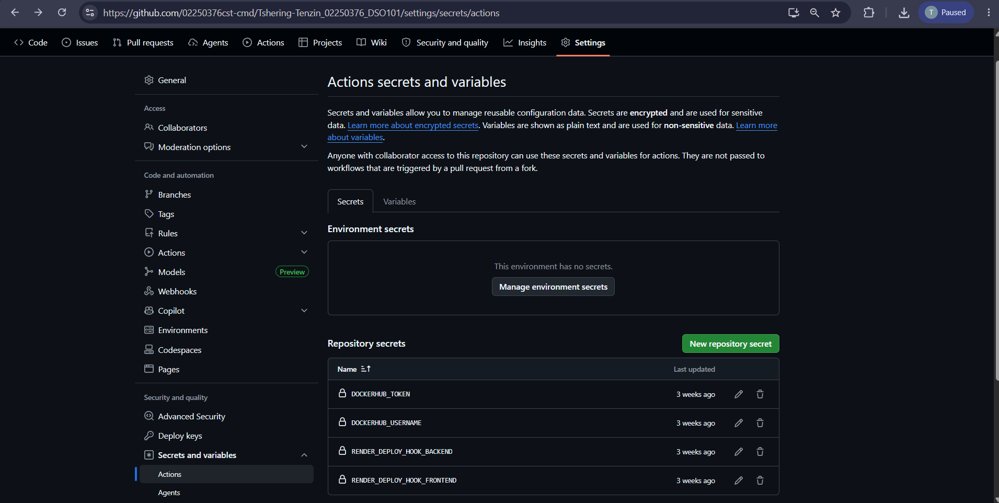

# git link https://github.com/02250376cst-cmd/Tshering-Tenzin_02250376_DSO101/tree/main/practical3

# Tshering Tenzin | 02250376 | DSO101 | Assignment 3

## GitHub Actions CI/CD — Docker Build, Push & Render Deployment

---


## Overview

This assignment configures a GitHub Actions workflow to automatically:
1. Build a Docker image for the Todo List backend (from Assignment 1)
2. Push the image to Docker Hub
3. Trigger a redeployment on Render.com via webhook

Every time code is pushed to the `main` branch, the entire pipeline runs automatically — no manual steps needed.

---

## Tools & Technologies

| Tool | Purpose |
|------|---------|
| GitHub | Source code hosting |
| GitHub Actions | CI/CD automation |
| Docker | Containerization |
| Docker Hub | Container image registry |
| Render.com | Cloud deployment |
| Node.js & npm | Backend runtime |
| Jest | Testing framework |

---

## Task 1: GitHub Repository Setup

### Repository
```
https://github.com/tsheringtenzin/Tshering-Tenzin_02250376_DSO101_A1
```

### `package.json` scripts
```json
{
  "scripts": {
    "start": "node server.js",
    "test": "jest --ci --reporters=default --reporters=jest-junit",
    "build": "echo 'No build step for backend'"
  },
  "jest-junit": {
    "outputFile": "junit.xml"
  }
}
```

> Repository must be **public** for GitHub Actions to run on the free tier.

---

## Task 2: Dockerfile Verification

### Backend Dockerfile (`backend/Dockerfile`)
```dockerfile
FROM node:20-alpine
WORKDIR /app
COPY package*.json ./
RUN npm install
COPY . .
EXPOSE 5000
CMD ["node", "server.js"]
```

### Frontend Dockerfile (`frontend/Dockerfile`)
```dockerfile
FROM node:20-alpine
WORKDIR /app
COPY package*.json ./
RUN npm install
COPY . .
RUN npm run build
FROM nginx:alpine
COPY --from=0 /app/build /usr/share/nginx/html
EXPOSE 80
CMD ["nginx", "-g", "daemon off;"]
```

### Test locally
```bash
# Backend
cd backend
docker build -t tsheringtenzin/be-todo:02250376 .
docker run -p 5000:5000 --env-file .env tsheringtenzin/be-todo:02250376

# Frontend
cd frontend
docker build -t tsheringtenzin/fe-todo:02250376 .
docker run -p 3000:80 tsheringtenzin/fe-todo:02250376
```

---

## Task 3: GitHub Actions Workflow

### File: `.github/workflows/deploy.yml`

```yaml
name: Build, Push and Deploy

on:
  push:
    branches: ["main"]

jobs:
  build-and-deploy:
    runs-on: ubuntu-latest

    steps:
      # 1. Checkout code
      - name: Checkout Repository
        uses: actions/checkout@v4

      # 2. Login to DockerHub
      - name: Login to DockerHub
        uses: docker/login-action@v3
        with:
          username: ${{ secrets.DOCKERHUB_USERNAME }}
          password: ${{ secrets.DOCKERHUB_TOKEN }}

      # 3. Build & Push Backend Docker Image
      - name: Build and Push Backend Image
        run: |
          docker build -t ${{ secrets.DOCKERHUB_USERNAME }}/be-todo:02250376 ./practical1/todo-app/backend
          docker build -t ${{ secrets.DOCKERHUB_USERNAME }}/be-todo:latest ./practical1/todo-app/backend
          docker push ${{ secrets.DOCKERHUB_USERNAME }}/be-todo:02250376
          docker push ${{ secrets.DOCKERHUB_USERNAME }}/be-todo:latest

      # 4. Build & Push Frontend Docker Image
      - name: Build and Push Frontend Image
        run: |
          docker build -t ${{ secrets.DOCKERHUB_USERNAME }}/fe-todo:02250376 ./practical1/todo-app/frontend
          docker build -t ${{ secrets.DOCKERHUB_USERNAME }}/fe-todo:latest ./practical1/todo-app/frontend
          docker push ${{ secrets.DOCKERHUB_USERNAME }}/fe-todo:02250376
          docker push ${{ secrets.DOCKERHUB_USERNAME }}/fe-todo:latest

      # 5. Trigger Render Backend Redeployment
      - name: Trigger Render Backend Deployment
        run: |
          curl -X POST ${{ secrets.RENDER_DEPLOY_HOOK_BACKEND }}

      # 6. Trigger Render Frontend Redeployment
      - name: Trigger Render Frontend Deployment
        run: |
          curl -X POST ${{ secrets.RENDER_DEPLOY_HOOK_FRONTEND }}
```

---

## GitHub Secrets

Set these in **GitHub → Repository → Settings → Secrets and variables → Actions → New repository secret**:

 


### How to get Docker Hub Access Token
1. Login to [hub.docker.com](https://hub.docker.com)
2. Account Settings → **Security** → **New Access Token**
3. Name it `github-actions`, copy and save it

### How to get Render Deploy Hook
1. Render Dashboard → your service → **Settings** tab
2. Scroll to **Deploy Hook** → copy the URL

>  **Never hardcode credentials in your workflow file. Always use secrets.**

---

## Task 4: Render Deployment

### Deploy from Existing Docker Image
1. Render → **New +** → **Web Service**
2. Select **"Existing image from registry"**
3. Image: `tsheringtenzin/be-todo:latest`
4. Region: `Oregon (US West)`
5. Add Environment Variables:

| Key | Value |
|-----|-------|
| `DATABASE_URL` | *(Internal DB URL from Render Postgres)* |
| `DB_SSL` | `true` |
| `PORT` | `5000` |

6. Click **Create Web Service**

### How Auto-Deploy Works
```
Git push → GitHub Actions triggers → Docker image built & pushed → 
Render webhook called → Render pulls new image → Live site updated
```

---

## Live URLs

| Service | URL |
|---------|-----|
| Frontend | https://frontend-todo-k4yv.onrender.com |
| Backend | https://be-todo-02250376-4.onrender.com |
| Docker Hub | https://hub.docker.com/u/tsheringtenzin |

---

## Docker Hub Images

| Image | Tag |
|-------|-----|
| `tsheringtenzin/be-todo` | `02250376`, `latest` |
| `tsheringtenzin/fe-todo` | `02250376`, `latest` |