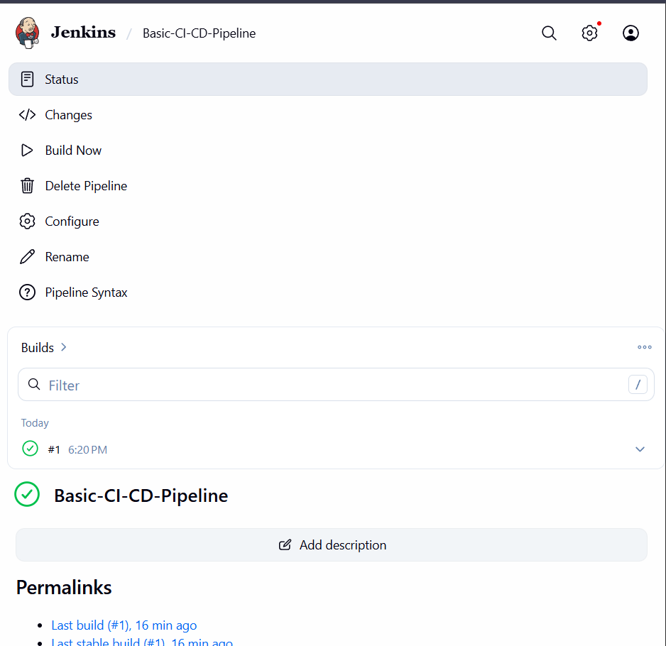

# Practical 4: Jenkins Server & Basic CI/CD Pipeline

**Student:** Tshering Tenzin  
**Student ID:** 02250376  
**Date:** 2026-05-22  
**Module:** DSO101 – DevOps

## Objective
Set up a Jenkins server on Windows and create a Declarative Pipeline with multiple stages (Checkout, Build, Test, Deploy) that simulates a CI/CD workflow.

## Jenkins Setup
- **Installation:** Native Windows MSI installer
- **Access URL:** http://localhost:8080
- **Plugins:** Suggested plugins installed during first startup

## Pipeline Stages
| Stage | Description | Implementation |
|-------|-------------|----------------|
| Checkout | Simulate fetching code from Git | Creates dummy `README.md` file |
| Build   | Simulate build step | `echo` commands |
| Test    | Simulate running tests | `echo` commands |
| Deploy  | Simulate deployment | `echo` commands |

## Pipeline Script (Windows-compatible)

```groovy
pipeline {
    agent any
    
    stages {
        stage('Checkout') {
            steps {
                echo 'Checking out code from Git repository...'
                bat 'mkdir demo-repo 2>nul'
                bat 'echo Hello > demo-repo\\README.md'
                echo 'Code checkout complete'
            }
        }
        stage('Build') {
            steps {
                echo 'Building the application...'
                bat 'echo "Build step executed"'
            }
        }
        stage('Test') {
            steps {
                echo 'Running tests...'
                bat 'echo "All tests passed"'
            }
        }
        stage('Deploy') {
            steps {
                echo 'Deploying to staging...'
                bat 'echo "Deployment successful"'
            }
        }
    }
    
    post {
        success {
            echo 'Pipeline succeeded!'
        }
        failure {
            echo 'Pipeline failed!'
        }
    }
}
```
## Execution Result
Build #1: SUCCESS

Console output shows all four stages executed in order

All bat commands completed without errors

## Screenshots

    

## Configuration Requirements Met
Jenkins server running on http://localhost:8080

Pipeline job created

Multi-stage pipeline (Checkout, Build, Test, Deploy)

Pipeline executes successfully on Windows (using bat)